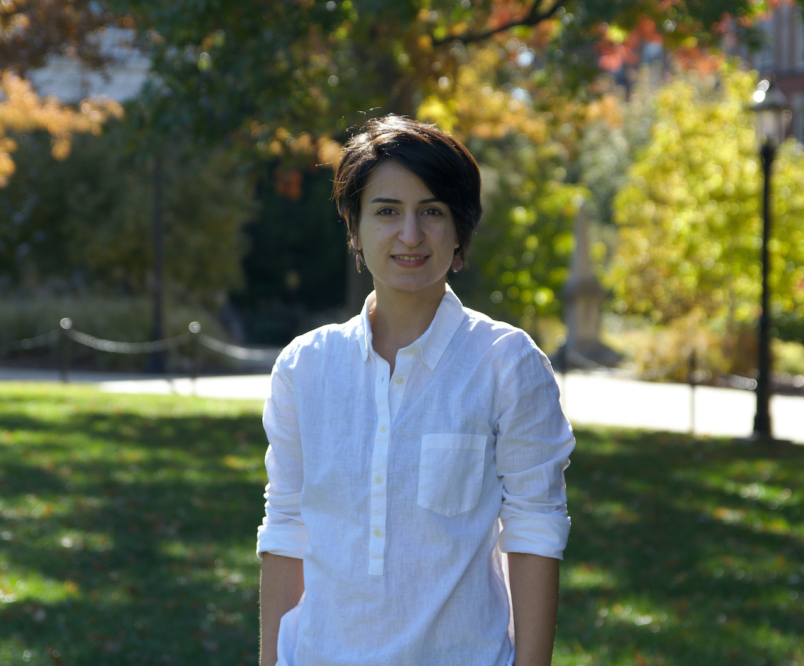

 

## About me...

<!-- wp:image {"id":81,"width":242,"height":128,"sizeSlug":"small"} -->
<figure class="wp-block-image size-small is-resized"></figure>
<!-- /wp:image -->

I am an Assistant Professor in [the Department of Mathematics and Statistics at Saint Louis University](https://mathstat.slu.edu/). My research interests include applied harmonic analysis, frame theory, phase retrieval, and functional analysis. You can read more about my research under the research tab. I am currently supported by the National Science Foundation grant DMS-2154931.

I am also a faculty advisor for the student chapter of the Association for Women in Mathematics at Saint Louis University. You can check out this [webpage](https://mathstat.slu.edu/resources/awm) to learn more about the events of the chapter. 
 

### Links:

[My CV](https://dorigh.github.io/resume.pdf)
